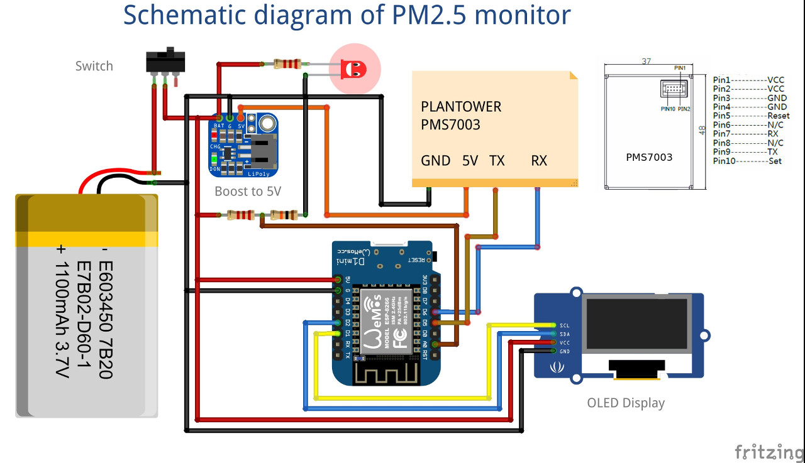
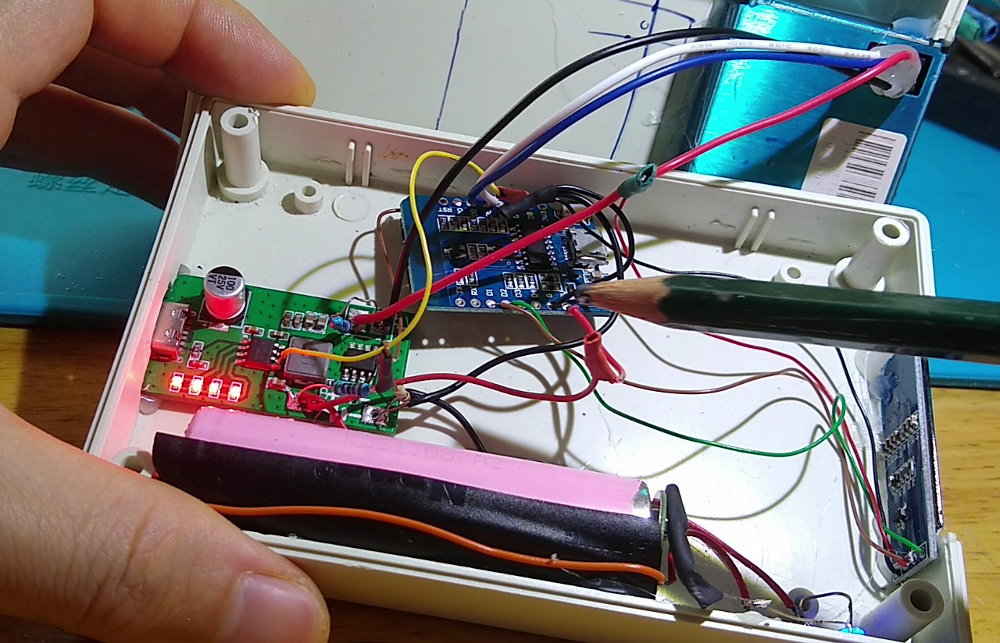

# PM2.5-monitor
Build air quality monitor of PM2.5 (fine particles) with low-cost sensor and ESP32/ESP8266

  

## v1. Easy - peasy
### Schematics:

  

### Inside:

  

### Parts:  
1. PMS7003 (my choice), also works with PMS5003. Other dust sensor works as well, subject to change of the code  
2. ESP8266 (WeMos D1 mini)  
3. Lithium battery protection + boost-up board (5V)  
4. OLED display  

